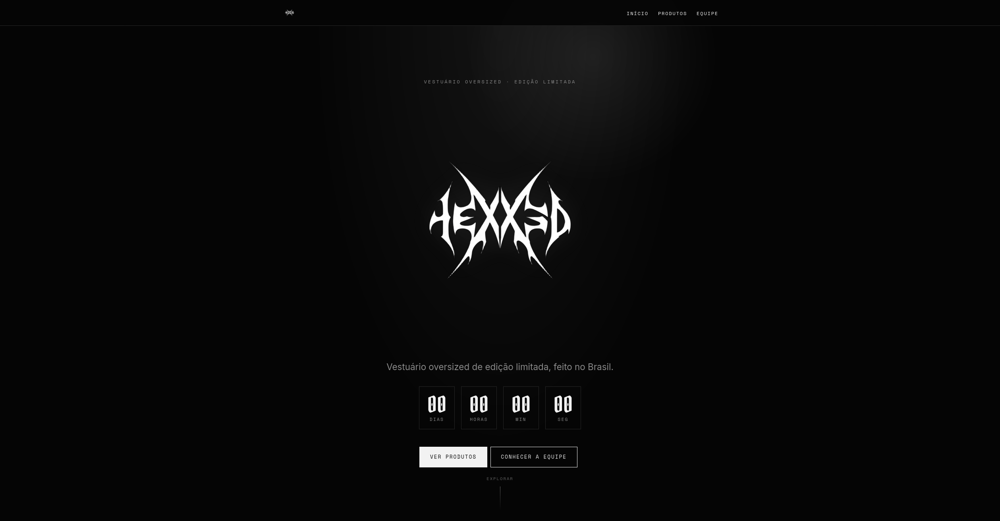
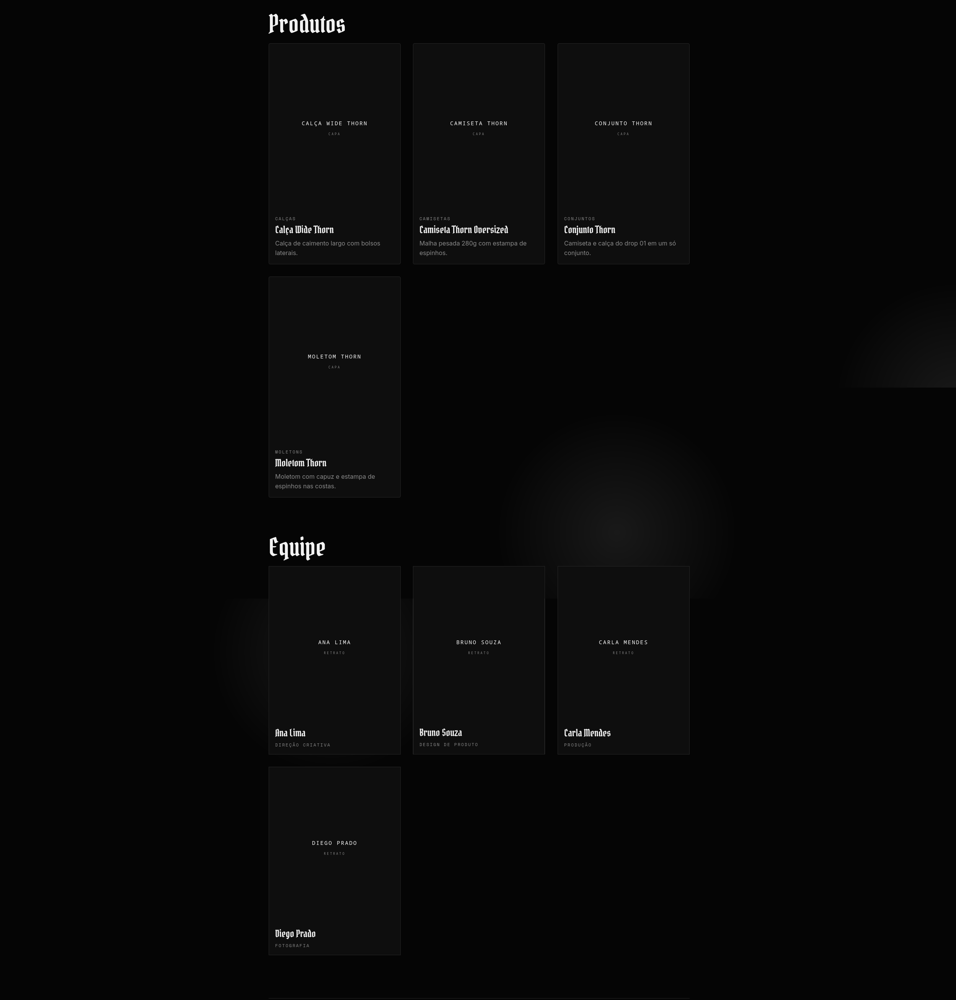
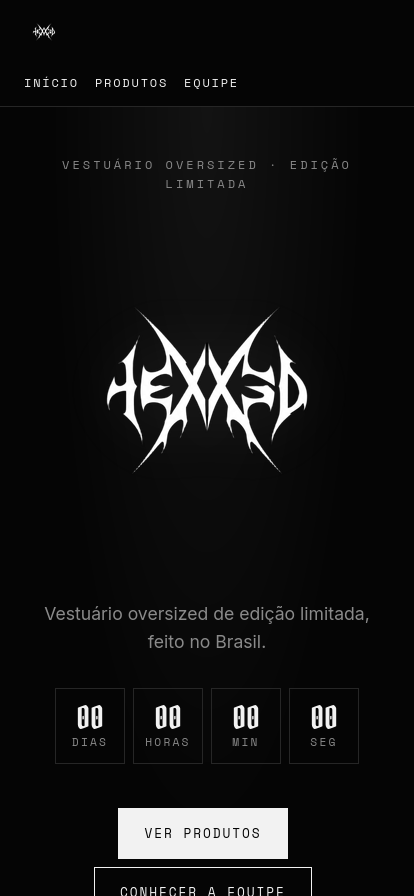
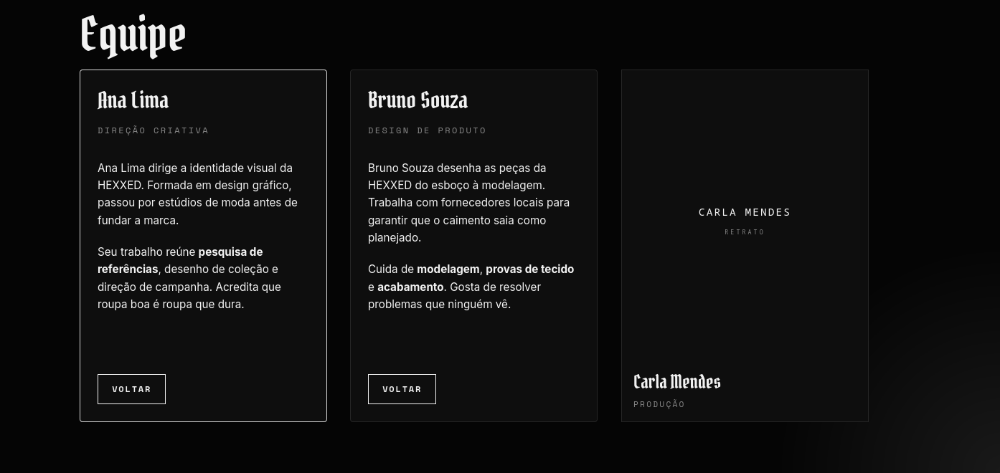
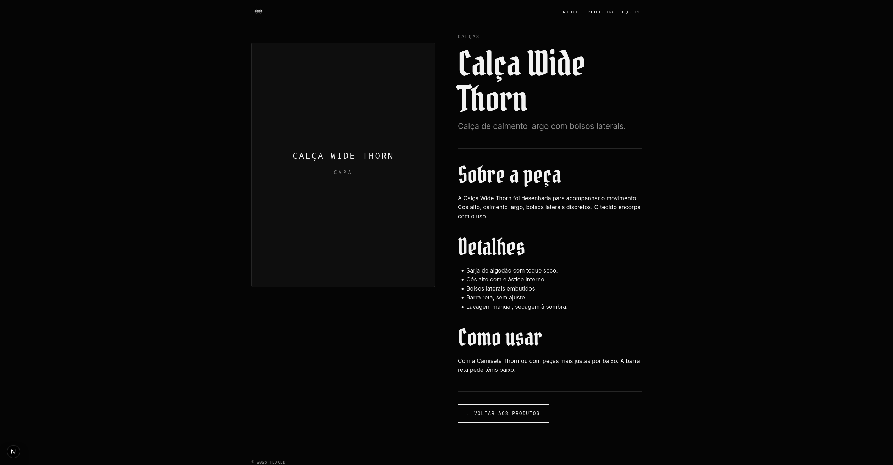

# Entrega — HEXXED

Página institucional fictícia da **HEXXED**, marca de vestuário oversized. Construída com React 19 + Next.js 15 (App Router) + MDX, seguindo o contrato de arquivos do **Webtech Editor**.

---

## Como executar

Requisitos: Node.js 22+ (recomendado 24) e npm.

```bash
npm ci
npm run dev
```

Abra [http://localhost:3000](http://localhost:3000).

Para verificar tudo (lint + testes + build):

```bash
npm run check
```

Para uma versão de produção local:

```bash
npm run build
npm start
```

---

## Estrutura

```text
app/
  layout.js                layout raiz (header, footer, fontes)
  template.js              transição de entrada entre páginas (Client)
  page.js                  home institucional (Server)
  globals.css              tema HEXXED
  not-found.js             página 404
  paginas/[slug]/page.js   página editorial (herdada do lab)
  produtos/[slug]/page.js  detalhe de produto
components/
  EditorialContent.js      renderiza o corpo MDX (Server)
  Callout.js               componente MDX registrado
  ProductCard.js           card de produto (apresentacional)
  TeamCard.js              card de integrante (apresentacional)
  TeamMemberModal.js       modal animado do integrante (Client)
  GlowEffect.js            glow radial seguindo o mouse (Client)
  RevealOnScroll.js        blur reveal + stagger no scroll (Client)
cms/
  estrutura.json           schema das coleções para o Webtech Editor
content/
  paginas/empresa.mdx
  produtos/*.mdx           3 produtos
  equipe/*.mdx             3 integrantes
lib/
  content.mjs              leitor de MDX (server-only)
public/images/
  marca/logo.jpeg
  produtos/<slug>/capa.svg
  equipe/<slug>/retrato.svg
tests/
  content.test.mjs         testes do leitor
```

---

## Capturas de tela

> **Substitua os placeholders abaixo pelos prints reais.**

### Home em desktop (1280px)



A home tem: hero com logo, tagline, contagem decorativa e dois botões; seção de apresentação renderizada do corpo de `empresa.mdx`; grade de 3 produtos; grade de 3 integrantes.

### Seções Produtos e Equipe (desktop)



Os cards de produto são links para `/produtos/<slug>`. Os cards de equipe abrem um modal animado ao clique.

### Home em mobile (390px)



Sem rolagem horizontal. Grids empilham em 1 coluna. Header reorganiza.

### Modal de equipe aberto



O card sobe, gira e expande ao clique. Fecha com Esc, clique fora ou botão "Fechar". Foco preso dentro do modal.

### Detalhe de produto



Layout em duas colunas em desktop: imagem à esquerda, conteúdo à direita. Em mobile, empilha.

---

## Resultados das verificações

### `npm run check`

```
> lab-react-mdx@1.0.0 check
> npm run lint && npm test && npm run build

> lab-react-mdx@1.0.0 lint
> eslint .
(0 erros, 0 warnings)

> lab-react-mdx@1.0.0 test
> node --conditions=react-server --test tests/*.test.mjs

✔ separa metadados e corpo, preservando JSX e acentos
✔ descobre novos documentos, ordena por slug e ignora outros arquivos
✔ documento ausente retorna null e coleção sem pasta retorna lista vazia
✔ impede leitura por slugs fora da convenção e coleções desconhecidas
✔ não oculta YAML inválido como se fosse documento inexistente
✔ recusa schema apontando para fora da convenção de conteúdo

ℹ tests 6
ℹ pass 6
ℹ fail 0

> lab-react-mdx@1.0.0 build
> next build

   ▲ Next.js 15.5.26
 ✓ Compiled successfully
 ✓ Linting and checking validity of types
 ✓ Generating static pages (9/9)

Route (app)                                 Size  First Load JS
┌ ○ /                                    1.65 kB         176 kB
├ ○ /_not-found                            124 B         103 kB
├ ● /paginas/[slug]                        124 B         103 kB
├   ├ /paginas/boas-vindas
├   └ /paginas/empresa
└ ● /produtos/[slug]                       165 B         106 kB
    ├ /produtos/calca-wide-thorn
    ├ /produtos/camiseta-thorn
    └ /produtos/conjunto-thorn
```

### Verificações manuais

- **Slug inexistente** (`/produtos/nao-existe`): exibe a página 404 (`app/not-found.js`).
- **Coleções vazias**: a home trata `[]` com mensagem ("Nenhum produto cadastrado ainda.").
- **`empresa.mdx` ausente**: a home chama `notFound()` e mostra 404.
- **Responsividade**: sem rolagem horizontal a 390 px e 1280 px; grids empilham em mobile.
- **Acessibilidade**: foco visível, `alt` em todas as imagens, navegação por teclado (Tab/Enter/Esc), `prefers-reduced-motion` respeitado nos efeitos e transições.
- **Teste decisivo**: ver seção abaixo.

---

## Respostas

### 1. O que o `estrutura.json` controla e o que precisa ser implementado em React/Next.js?

O `cms/estrutura.json` descreve as **coleções** para o Webtech Editor: `id`, `label`, `folder`, `extension` e a lista de `fields` (com `name`, `label` e `widget`). Ele diz ao editor **onde** cada tipo de documento mora (`content/<id>`) e **quais campos** o autor deve preencher. O leitor deste projeto usa o `folder` e o `extension` para localizar os arquivos — se o schema apontar para fora de `content/<id>` com extensão `mdx`, o leitor lança erro.

O schema **não cria** páginas, não cria componentes e não renderiza nada. Ele é apenas um contrato de arquivos. Tudo o que aparece na tela — a home, os cards, a rota de produto, o modal de equipe — precisa ser implementado em React/Next.js. Cadastrar um campo no schema **não faz** com que ele apareça: o componente precisa consumi-lo explicitamente (`doc.frontmatter.<campo>`). O schema também não valida tipos nem campos obrigatórios nesta base; os widgets do editor são apenas dicas visuais.

### 2. Qual a diferença entre coleção, slug, rota e pasta de imagens?

- **Coleção** é um agrupamento lógico de documentos com a mesma finalidade. Neste projeto há três: `paginas`, `produtos` e `equipe`. Cada uma tem sua própria pasta em `content/`.
- **Slug** é o identificador de um documento dentro de uma coleção. Corresponde ao nome do arquivo sem a extensão — `content/produtos/camiseta-thorn.mdx` tem slug `camiseta-thorn`. Slugs seguem uma convenção restrita (minúsculas, números e hífens), validada por `lib/content.mjs`.
- **Rota** é o endereço público que uma página do Next.js atende. Uma rota como `/produtos/[slug]` é dinâmica: o segmento `[slug]` é capturado pelo parâmetro `params.slug` e entregue ao componente. A mesma implementação serve a todos os slugs de uma coleção.
- **Pasta de imagens** é onde os arquivos de imagem de um documento ficam versionados. O Webtech Editor usa `public/images/<coleção>/<slug>/`. A URL correspondente **não inclui** `public` — a imagem `public/images/produtos/camiseta-thorn/capa.svg` é servida em `/images/produtos/camiseta-thorn/capa.svg`.

### 3. Como o frontmatter difere do corpo MDX?

O **frontmatter** é um bloco YAML delimitado por `---` no início do arquivo. Ele guarda **dados estruturados**: título, descrição, caminho de imagem, alt, categoria, nome, cargo, etc. O `gray-matter` o parseia e o leitor devolve como objeto (`frontmatter`). É o que a interface usa para preencher componentes (título de página, nome no card, imagem, etc.).

O **corpo** é tudo o que vem **depois** do frontmatter. Ele é texto livre em Markdown (parágrafos, subtítulos, listas, ênfase), podendo — em teoria — conter JSX. Neste projeto, o corpo é mantido em **Markdown puro**, porque a prévia do Webtech Editor usa `marked` (que não executa componentes React personalizados). O corpo é renderizado no servidor pelo `EditorialContent`, que usa `MDXRemote` do `next-mdx-remote/rsc`.

Em resumo: o frontmatter é **metadado** (a interface consome), o corpo é **conteúdo editorial** (a página exibe). Um documento pode ter só frontmatter, só corpo ou ambos.

### 4. Por que a leitura e a renderização ficam no servidor?

Porque o leitor (`lib/content.mjs`) usa `node:fs/promises` para ler arquivos do disco. Isso só existe no runtime do Node.js, não no navegador. O arquivo importa `server-only`, o que faz o build falhar se algum Client Component tentar importá-lo — uma proteção deliberada contra uso acidental.

Manter a leitura no servidor tem três consequências:

1. **Segurança:** o cliente nunca vê caminhos internos, estrutura de pastas ou lógica de leitura.
2. **Performance:** o trabalho de parsing do MDX acontece uma vez, no build (para rotas estáticas) ou no servidor (para rotas dinâmicas), e o resultado é HTML pronto.
3. **Compatibilidade:** `gray-matter` e `next-mdx-remote/rsc` são feitos para o servidor. No cliente, exigiriam alternativas mais pesadas ou execução de código arbitrário.

Quando um componente precisa de interatividade (o modal de equipe, o glow, o reveal no scroll), ele é isolado como Client Component (`"use client"`) e recebe **apenas os dados já prontos** por props. O corpo MDX já renderizado é passado como `children` do `TeamMemberModal` — o leitor nunca atravessa a fronteira cliente/servidor.

### 5. O que acontece entre salvar no editor e ver a alteração no site publicado?

O fluxo completo:

```text
Webtech Editor → rascunho local (IndexedDB)
              → publicação (commit no GitHub, branch padrão)
              → build/deploy da aplicação (CI ou manual)
              → site atualizado
```

1. **Rascunho.** No Webtech Editor, salvar um rascunho grava as mudanças no **IndexedDB do navegador**, por conta e repositório. Nada vai para o GitHub ainda.
2. **Publicação.** Ao publicar, o editor envia as alterações à **branch padrão** do repositório, verificando conflitos com os arquivos remotos. O commit no GitHub é o que dispara o restante.
3. **Build/deploy.** Uma pipeline (CI, Vercel, Netlify, ou build manual) detecta o novo commit, instala dependências, roda `next build` — que executa `generateStaticParams`, lê todos os MDX e pré-renderiza as páginas — e publica o resultado.
4. **Atualização.** O site passa a servir a nova versão. O arquivo MDX foi lido, parseado, seu frontmatter virou props de componentes e seu corpo virou HTML.

Pontos importantes:

- **Mudanças locais não atualizam uma publicação em execução.** O site publicado serve o que foi construído no último deploy. Para alterar, é preciso um novo build.
- **Em desenvolvimento local**, o `npm run dev` recarrega ao salvar, então a iteração é imediata. Em produção, **pare o servidor, refaça o build e reinicie** após alterar conteúdo ou mover imagens.
- A prévia do Webtech Editor é genérica (usa `marked`) e **não reflete** o layout real da aplicação. O resultado final precisa ser conferido no Next.js.

---

## Teste decisivo: conteúdo sem alteração de código

O teste prova que **novos documentos entram sem tocar em JSX**. Foi executado em branch separada (`teste/conteudo-dinamico`), criada a partir de `feat/hexxed` e descartada depois.

Procedimento:

1. Criar `content/produtos/moletom-thorn.mdx` (4º produto) e `public/images/produtos/moletom-thorn/capa.svg`.
2. Criar `content/equipe/diego-prado.mdx` (4º integrante) e `public/images/equipe/diego-prado/retrato.svg`.
3. Rodar `npm run check`. O build passa a gerar **10 páginas** (antes: 9), incluindo `/produtos/moletom-thorn`.
4. Abrir a home. Os dois novos cards aparecem **sem alterar nenhum `.js`**.
5. Editar o `name` do produto no MDX. A home reflete a mudança.
6. Editar a biografia do integrante no MDX. O modal reflete a mudança.
7. Renomear `moletom-thorn.mdx` para `.mdx.bak` e recarregar. O card desaparece. Reverter.
8. Repetir com o integrante.
9. Descartar a branch de teste. A `feat/hexxed` volta a ter **3 produtos + 3 integrantes**.

Resultados observados:

| Etapa | Resultado |
|---|---|
| Criar 4º produto + imagem | Aparece na home; rota `/produtos/moletom-thorn` gerada |
| Criar 4º integrante + imagem | Aparece na home; modal abre com a biografia |
| Editar nome do produto no MDX | Home reflete sem tocar em `.js` |
| Editar biografia no MDX | Home reflete sem tocar em `.js` |
| Remover arquivo do produto | Card desaparece da home |
| Remover arquivo do integrante | Card desaparece da home |
| `npm run check` com 4+4 | Passa; build com 10 páginas |

Isso confirma que:

- A home usa `listContent` (não um array fixo).
- Os cards recebem props (não têm catálogo embutido).
- O leitor varre a pasta da coleção.
- `generateStaticParams` descobre os novos slugs sozinho.

---

## Caminho do conteúdo: do arquivo à tela

```text
content/produtos/camiseta-thorn.mdx
        │
        ▼
lib/content.mjs (server-only)
  getContent("produtos", "camiseta-thorn")
  ├─ lê cms/estrutura.json
  ├─ valida collection, folder, extension
  ├─ abre o arquivo
  └─ gray-matter separa frontmatter e content
        │
        ▼
{ collection, slug, frontmatter, content }
        │
        ├─► app/page.js (home)
        │     listContent("produtos")
        │       └─► ProductCard (props do frontmatter)
        │             └─► <Link href="/produtos/camiseta-thorn">
        │
        └─► app/produtos/[slug]/page.js
              getContent("produtos", slug)
                ├─ se null → notFound()
                └─ senão:
                     <h1>{frontmatter.name}</h1>
                     
                     <EditorialContent source={content} />
```

Para a equipe, o fluxo é análogo, com o corpo do MDX sendo passado como `children` para o `TeamMemberModal` (Client Component), que anima a abertura.

Para a empresa, a home chama `getContent("paginas", "empresa")` diretamente — não lista `paginas`, para não incluir o documento herdado do lab (`boas-vindas.mdx`).

---

## Decisões de arquitetura

- **Leitura no servidor.** `lib/content.mjs` importa `server-only`. Nenhum Client Component o importa.
- **Cards apresentacionais.** `ProductCard` e `TeamCard` recebem tudo por props. Não sabem de onde vêm os dados. Reutilizáveis, testáveis e sem catálogo fixo.
- **Chave React = slug.** Toda lista usa `key={doc.slug}`, evitando re-render desnecessário e mantendo identidade estável.
- **`empresa.mdx` ausente → `notFound()`.** A home não faz sentido sem a apresentação. É um comportamento explícito, não um fallback silencioso.
- **Coleções vazias → mensagem.** `listContent` retorna `[]`; a home mostra um aviso em vez de quebrar.
- **Interatividade isolada.** Modal, glow e reveal no scroll são Client Components. Todo o resto é Server.
- **`prefers-reduced-motion` respeitado.** `template.js`, `TeamMemberModal`, `GlowEffect` e `RevealOnScroll` checam a media query e neutralizam animações quando necessário.
- **Sem dependências de UI.** Nada de Tailwind, CSS-in-JS ou bibliotecas de componentes. CSS puro, com variáveis para paleta e tipografia.

---

## O que ficou de fora (por escopo)

O desafio explicitamente **não pede** e não foi implementado:

- Preço, carrinho, checkout.
- Autenticação ou API.
- Seleção de tamanho.
- Rota de detalhe de integrante.

Também ficaram de fora, por decisão de escopo:

- **Marquee e dots de navegação** do template original.
- **Contagem regressiva funcional** — a contagem no hero é estática, apenas decorativa.
- **Spotlight no mouse** (além do glow radial já implementado).

O modelo de dados é compatível com a adição futura de carrinho: `ProductCard` recebe props e a rota `/produtos/[slug]` é um ponto natural para inserir um bloco de compra, sem tocar em MDX, schema ou leitor.
